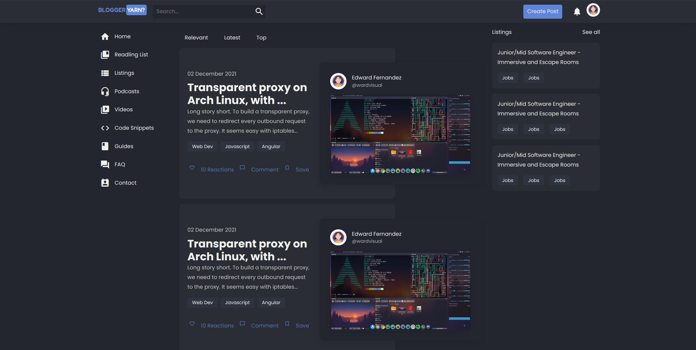

<!-- PROJECT LOGO -->
 

  

  <h3 align="center">Blogger Yarn?</h3>

  
 A web application that enables users to create and manage blog posts. This application provides a platform for users to share their thoughts and ideas with the world and also allows them to interact with other users who have similar interests. It utilizes NestJs and Angular. 
 
  
THIS PROJECT IS UNDER DEVELOPMENT.

     
     
    <a href="https://github.com/wardvisual/blogger-yarn"><strong>View Project »</strong></a>
         
     
    <a href="https://github.com/wardvisual/blogger-yarn">View Demo</a>
    ·
    <a href="https://github.com/wardvisual/blogger-yarn/issues">Report Bug</a>
    ·
    <a href="https://github.com/wardvisual/blogger-yarn/issues">Request Feature</a>
  

## 📷 Homepage

## 💻 Technologies

- Frontend: [Angular](https://angular.io/)
- Stylesheet: [SCSS](https://sass-lang.com/)
- Backend: [NestJS](https://nestjs.com/)
- ORM: [TypeORM](https://typeorm.io/)
- Database: [MySQL](https://www.mysql.com/)
- API Documentation: [Swagger](https://swagger.io/)

## ✅ Features

- Login / Signup
- Google / Facebook / Twitter / GitHub OAuth
- Create / Remove / Update / Delete Post
- Like / Unicorn / Bookmark Post
- Reading List
- Create / Add Tags to Post
- Follow Tags
- Find Posts by Tags
- Comment / Replies
- Like Comment
- Edit / Delete Comment
- View Profile
- Edit Profile
- Follow User
- Search Posts
- Real-time Notifications
- Skeleton Loading

## 🐛 Issues

If you're facing a problem using this web application please let me know by [creating an issue here](https://github.com/wardvisual/blogger-yarn/issues/new). I'm here to help you!

## 📃 License

"Blogger Yarn?" web app is licensed under [The MIT License](https://opensource.org/licenses/MIT).

## 📝 Author

"Blogger Yarn?" web app is created by **[Edward Fernandez](https://github.com/wardvisual/)**

---

💻 Made with 💕 by [Edward Fernandez](https://wardvisual.me)
