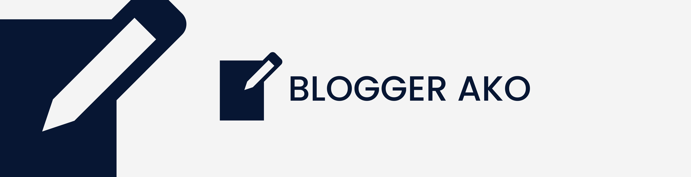

<div id="top"></div>

<!-- PROJECT LOGO -->
<br />
<div align="center">
  <a href="https://github.com/wardvisual/blogger-ako">
    
  </a>

  <h3 align="center">Blogger Ako</h3>

  <p align="center"> A blog web application utilizing NestJs for the backend and Angular for the frontend.</p> 
  <p>This project is under development.</p>
    <br />
    <br />
    <a href="https://github.com/wardvisual/blogger-ako"><strong>View Project »</strong></a>
    <br />    
    <br />
    <a href="https://github.com/wardvisual/blogger-ako">View Demo</a>
    ·
    <a href="https://github.com/wardvisual/blogger-ako/issues">Report Bug</a>
    ·
    <a href="https://github.com/wardvisual/blogger-ako/issues">Request Feature</a>
  
</div>

### Built With

- [Angular](https://angular.io/)
- [Typescript](https://www.typescriptlang.org/)
- [NestJS](https://nestjs.com/)
- [Swagger](https://swagger.io/)

<!-- INSTALLATION -->

### Installation

This project was restricted to only using NPM.

1. Clone the repo

   ```sh
   git clone https://github.com/wardvisual/blogger-ako.git
   ```

<!-- CONTACT -->

## Contact

Edward Fernandez - [@wardvisual](https://twitter.com/wardvisual)
Project Link: [blogger-ako](https://github.com/wardvisual/blogger-ako)
